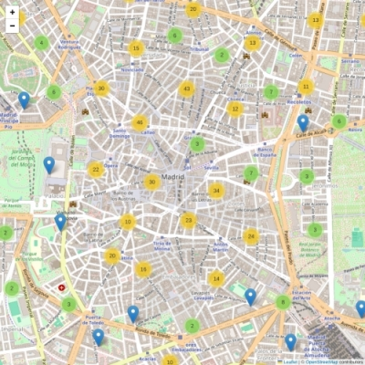
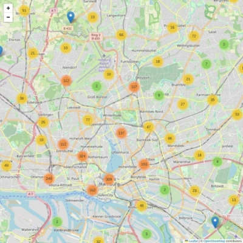

# A Supervised System for Curating Browsing Whitelists for Individuals with Cognitive Disabilities under Legal Guardianship

SafeWeb is a supervised system designed to help guardians create curated web whitelists for individuals under legal guardianship due to cognitive disabilities. Traditional blacklists are often ineffective for protecting this vulnerable population, as harmful or misleading content exists across the entire web. SafeWeb addresses this challenge by automatically compiling location-relevant whitelists of websites based on a ward's residential address and activity radius. The system categorizes websites into three types: facility (schools, healthcare, social centers), commerce (shops, services), and prohibited (gambling, adult content), enabling guardians to make informed decisions tailored to each individual's capabilities and needs. This tool can assist guardians in fulfilling their legal duty to protect wards while fostering maximum possible independence in the digital world.


Image from [www.freepik.com](https://www.freepik.com)

# Coverage

Australia (AU), Austria (AT), Belgium (BE), Canada (CA), Czech Republic (CZ), Denmark (DK), Finland (FI), France (FR), Germany (DE), Great Britain (GB), Italy (IT), Japan (JP), Netherlands (NL), Poland (PL), Portugal (PT), Slovakia (SK), Spain (ES), Sweden (SE), Switzerland (CH), United States (US)

# Content

Source code of the method [safeweb-method.ipynb](safeweb-method.ipynb)

Processed data for countries [result-method](result-method)

Example application [safeweb-practical.ipynb](safeweb-practical.ipynb) 

Validation ground truth [ground-truth](ground-truth)

Coverage maps [result-visual](result-visual)

# Coverage examples

SafeWeb coverage in Madrid city centre, Spain



SafeWeb coverage in Hamburg metro area, Germany



# Caching

SafeWeb data processing may take a long time due to extensive data retrieval and processing

REST API call cache is implemented to speed up the OpenStreetMap requests

```python 
memory = Memory(location=f'__cache',verbose=0)
```

# Acknowledgements 
Mapping data and geocoding from [OpenStreetMap](https://openstreetmap.org/copyright)
